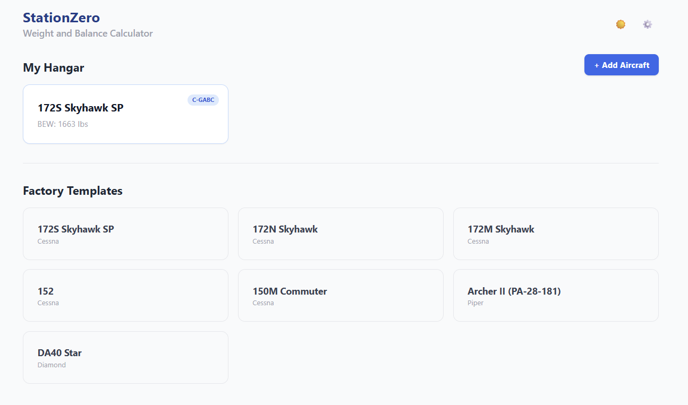
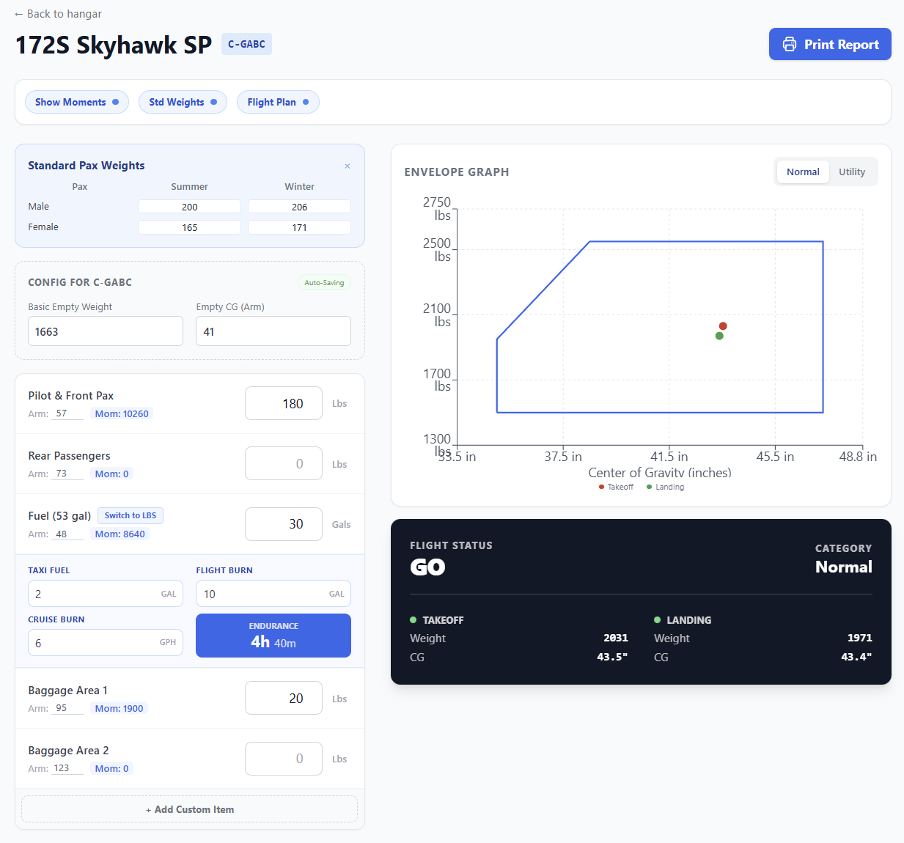

# StationZero ✈️

> **Modern, Offline-First Weight & Balance Calculator for General Aviation.**


**StationZero** is a progressive web application (PWA) designed to help pilots calculate weight and balance for General Aviation aircraft quickly and accurately. It works completely offline, ensuring functionality even in the cockpit or remote hangars.

[View Live Demo](https://stationzero.vercel.app)

---

## 📸 Screenshots

### Hangar Management


<br/>

### Calculator Interface


<br/>

### Printable Manifest


---

## ✨ Features

* **📱 Offline Capable (PWA):** Installable on iOS and Android. Works without an internet connection.
* **🛩️ Multi-Aircraft Support:** Manage a fleet of different aircraft with unique profiles.
* **📊 Dynamic Envelope Graph:** Visual CG plotting for Normal and Utility categories.
* **⚠️ Safety Checks:** Instant "Go/No-Go" feedback for Takeoff and Landing limits.
* **📄 Professional Manifest:** Generates a printable, legally-worded PDF report with a signature block.
* **🌓 Dark Mode:** Optimized for night flight operations to preserve night vision.
* **🔒 Privacy Focused:** All data is stored locally on your device. No cloud database, no tracking.

## 🛠️ Tech Stack

* **Framework:** [Next.js 14+](https://nextjs.org/) (App Router)
* **Styling:** [Tailwind CSS](https://tailwindcss.com/)
* **Language:** TypeScript
* **State Management:** React Hooks + LocalStorage API
* **Deployment:** Vercel

## 🚀 Getting Started

1.  **Clone the repository:**
    ```bash
    git clone [https://github.com/yourusername/stationzero.git](https://github.com/yourusername/stationzero.git)
    cd stationzero
    ```

2.  **Install dependencies:**
    ```bash
    npm install
    ```

3.  **Run the development server:**
    ```bash
    npm run dev
    ```

4.  Open [http://localhost:3000](http://localhost:3000) with your browser.

## ⚠️ Legal Disclaimer

**FOR EDUCATIONAL AND SITUATIONAL AWARENESS PURPOSES ONLY.**

This software is **not** a certified aviation device. It does **not** replace the official Pilot's Operating Handbook (POH) or the specific Weight & Balance data sheet for the aircraft being flown.

The **Pilot in Command (PIC)** is solely responsible for ensuring the aircraft is loaded within approved limits prior to every flight. The developers of StationZero assume no liability for the accuracy of calculations or data entry.

## 🤝 Contact

Created by Faiz - feel free to contact me!

## 📄 License

**Copyright © 2025 StationZero. All Rights Reserved.**

This project is proprietary software. Unauthorized copying, modification, distribution, or use of this file, via any medium, is strictly prohibited.